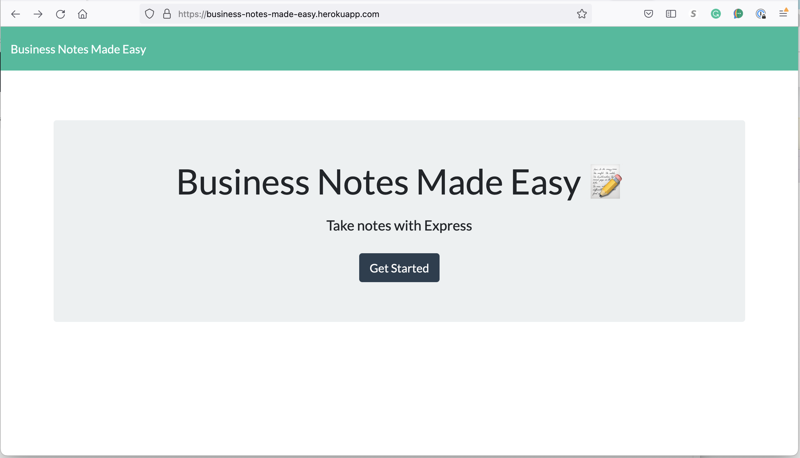

# Business Notes Made Easy

## Description

Ever had the need to jot down some quick notes while on the job? Business Notes Made Easy is the app for you. Quickly save notes that you can revisit in the near future. It also allows you to update notes and delete expired notes.

## Table of contents

- [Description](#description)
- [Installation](#installation)
- [Usage](#usage)
- [Licensing Information](#license)
- [Contribution Guidelines](#contributing)
- [Test Instructions](#tests)
- [Questions](#questions)

## Installation

Business Notes Made Easy is provided as a web application and can be accessed anywhere by simply pointing to the URL

## Usage

Point your device to https://business-notes-made-easy.herokuapp.com/

## License

Permissions of this strong copyleft license are conditioned on making available complete source code of licensed works and modifications, which include larger works using a licensed work, under the same license. Copyright and license notices must be preserved. Contributors provide an express grant of patent rights.

For more details on this license, go to http://choosealicense.com/licenses/gpl-3.0/

## Contributing

If you have ideas and ways to better this app, please email the developers at anthonypoku2022@u.northwestern.edu

## Tests

## Questions

My Github profile: [tonypoku](https://github.com/tonypoku-ghub)

For additional questions, please contact me at [tonypoku](anthonypoku2022@u.northwestern.edu)
